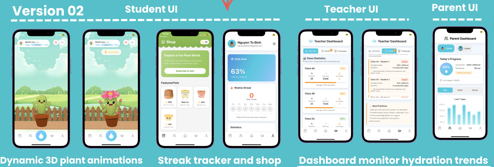
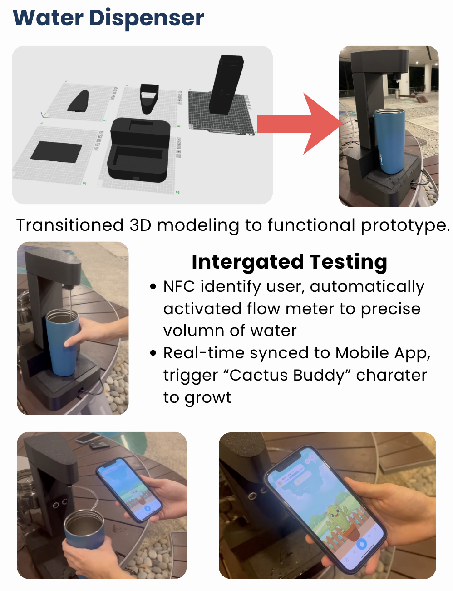

# Cactus Buddies 🌵💧

**Tagline:** *How do we develop a fun, easy way to encourage adequate water consumption amongst children?*

## 📖 Project Overview
**Cactus Buddies** is an interactive hydration ecosystem designed to encourage healthy drinking habits in students through Gamification and IoT technology.

## ⚠️ The Problem
Water is important, but children don't drink enough of it because water is "boring", unattractive, and easy to forget. Children often prefer sugary sodas instead. 
Additionally:
- **Schools & Teachers** are actively worried about children's water intake but cannot reliably remind them or keep track of all students. 
- **Parents** cannot watch their kids the whole day.
- **Health Impact:** Limited monitoring and poor consumption cause frequent mild dehydration, which leads to lower energy levels, poor concentration, reduced attention, and decreased cognitive function in learning environments.

## 💡 The Solution
Our solution combines three foundational pillars:
1. **Engaging the child:** Making water fun and desirable.
2. **Automating the habit:** Effortless tracking with smart tech.
3. **Connecting the family & schools:** Providing actionable insights for parents and teachers.

## UI 

## Intergrate with Waster Dispenser

## ✨ Key Features & Components

### 1. Mobile Application
- **Student UI:** Features dynamic 3D plant animations ("Cactus Buddy"), an interactive hydration streak tracker, and a reward shop. As the children drink water, their digital pet grows!
- **Teacher UI & Parent UI:** Detailed monitoring dashboards to track hydration trends, daily progress, and activity in real time. 

### 2. Smart Water Dispenser (IoT)
We integrated hardware testing with a customized water dispenser that features:
- **NFC Authentication:** Identifies the user immediately with a quick tap ("Feeling thirsty at school? A quick tap!").
- **Smart Flow Meter:** Automatically activated to measure the precise volume of water dispensed.
- **Real-Time Synchronization:** Data is instantly synced to the mobile app, triggering the user's "Cactus Buddy" character to grow to reflect real-time hydration.
- **Reward System:** Meeting hydration goals unlocks rewards, resulting in a worry-free and happy family experience.

## 👥 Meet Team Red
**Innovation by Design - Thursday**
- Binh
- Jiang
- Tom
- Nas
- May
- Huang
